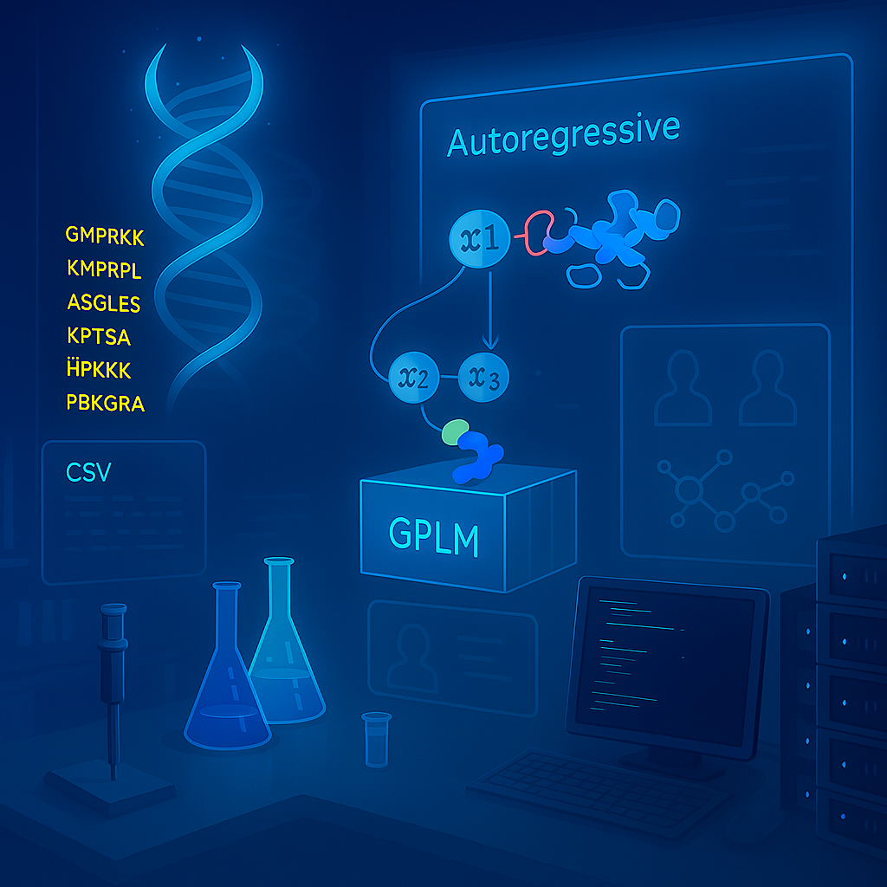

# ppiGPLM

A GPT-2-based protein language model repurposed for binary protein-protein interaction (PPI) classification. Built on [nanoGPT](https://github.com/karpathy/nanoGPT) by Andrej Karpathy.



## Overview

ppiGPLM uses a GPT-2 small architecture (12 layers, 12 attention heads, 768 embedding dimensions) with character-level tokenization to predict whether two proteins interact. Rather than using a separate classification head, ppiGPLM frames PPI prediction as next-token prediction: given a structured prompt encoding a protein pair, the model predicts a binary label (`0` or `1`) as the next token. Softmax probabilities over the label tokens provide continuous interaction scores.

The model was developed for the *Prochlorococcus marinus* MED4 interactome, where it serves as one component of a tri-model consensus framework for computational PPI screening.

## Architecture

| Parameter | Value |
|-----------|-------|
| Architecture | GPT-2 small |
| Layers | 12 |
| Attention heads | 12 |
| Embedding dimension | 768 |
| Context length | 4,096 tokens |
| Tokenization | Character-level (one token per amino acid) |
| Dropout | 0.2 |
| Optimizer | AdamW (lr = 5e-4, beta2 = 0.99) |
| Training iterations | 8,000 |

## Installation

### Prerequisites

- Python 3.8+
- CUDA-capable GPU (recommended) or CPU
- conda (recommended) or pip

### Setup

```bash
# Clone the repository
git clone https://github.com/kouroshSA/ppiGPLM.git
cd ppiGPLM

# Create a conda environment
conda create -n gpt python=3.10
conda activate gpt
pip install -r requirements.txt
```

## Repository Structure

```
ppiGPLM/
|-- model.py                          # GPT model definition
|-- train_.py                         # Training loop
|-- sample_fasta3.3_softmax_error_handling3e.py  # Batch inference script
|-- LES-wrapper.py                    # Learning Efficiency Score evaluation wrapper
|-- LES-wrapper.md                    # LES-wrapper documentation
|-- roc_analysis_color_threshold_F1e.py  # ROC curve analysis
|-- configurator.py                   # Configuration utility
|-- config/
|   |-- train_par_gpt2-s_scratch.py   # Training config (GPT-2 small, from scratch)
|   +-- finetune_label3.py            # Fine-tuning config
|-- data/
|   +-- MED4_char/                    # MED4 PPI dataset
|       |-- prepare.py                # Character-level tokenizer
|       +-- meta.pkl                  # Vocabulary (stoi/itos mappings)
|-- assets/
|   |-- ppiGPLM.png                  # ASCII workflow diagram
|   |-- tri_model_consensus.svg      # Tri-model consensus framework (SVG)
|   +-- tri_model_consensus.png      # Tri-model consensus framework (PNG)
|-- requirements.txt
|-- LICENSE
+-- README.md
```

## Usage

### Prompt Format

Each prompt encodes a protein pair with metadata tags:

```
<ps1>,MSEQ1...,<ps2>,MSEQ2...,<l1>,len1,<l2>,len2,<l3>
```

- `<ps1>`, `<ps2>`: Protein sequence delimiters
- `<l1>`, `<l2>`, `<l3>`: Length field delimiters
- The model predicts `1` (interacting) or `0` (non-interacting) as the next token

### Batch Inference

Run inference on a set of protein pairs:

```bash
python sample_fasta3.3_softmax_error_handling3e.py \
    --input_file protein_pairs.txt \
    --output_dir ppi_results \
    --output_prefix my_predictions
```

This produces:
- `*_classifications.txt`: Full model output in FASTA-like format
- `*_probabilities.csv`: Per-pair probabilities for class 1 and class 0

### Training

#### Prepare data

```bash
python data/MED4_char/prepare.py
```

This creates `train.bin`, `val.bin`, and `meta.pkl` from the input training data.

#### Train the model

```bash
# Single GPU
python train_.py config/train_par_gpt2-s_scratch.py

# Multi-GPU (2 GPUs)
torchrun --standalone --nproc_per_node=2 train_.py config/train_par_gpt2-s_scratch.py
```

### Learning Efficiency Score (LES) Evaluation

The LES-wrapper automates evaluation across multiple training checkpoints, computing ROC-AUC, F1, and optimal threshold at each checkpoint and deriving integrated Learning Efficiency Scores:

```bash
python LES-wrapper.py \
    --checkpoint_dir out \
    --prs_file PRS.txt \
    --rrs_file RRS.txt \
    --output_dir LES_results \
    --vanilla
```

See [LES-wrapper.md](LES-wrapper.md) for full documentation.

### Standalone ROC Analysis

```bash
python roc_analysis_color_threshold_F1e.py \
    --prs_file ppi_results/PRS_probabilities.csv \
    --rrs_file ppi_results/RRS_probabilities.csv
```

## Architecture Diagrams

The ASCII workflow diagram (`assets/ppiGPLM.png`) covers:
- **A.** Prompt-based input strategy (character-level tokenization)
- **B.** Model architecture (GPT-2 small, causal self-attention)
- **C.** Training pipeline
- **D.** Inference pipeline with LES evaluation

> Note: the diagram lists "Flash Attention" — this path is taken automatically
> when running on PyTorch ≥ 2.0; older versions fall back to the manual
> scaled-dot-product implementation. Numerical results are equivalent.

See `assets/tri_model_consensus.svg` for the tri-model consensus framework with [ppiDCE](https://github.com/kouroshSA/ppiDCE) and [ppiBTEP](https://github.com/kouroshSA/ppiBTEP).

## Citation

If you use this software, please cite:

```
Daakour, S. et al. (2026).
```

This software is built on nanoGPT:

```
Karpathy, A. (2022). nanoGPT. https://github.com/karpathy/nanoGPT
```

## License

This project is licensed under the MIT License. See [LICENSE](LICENSE) for details.

The original nanoGPT framework is by Andrej Karpathy (MIT License, 2022). Modifications and additions for protein-protein interaction prediction are by Kourosh Salehi-Ashtiani (MIT License, 2026).
